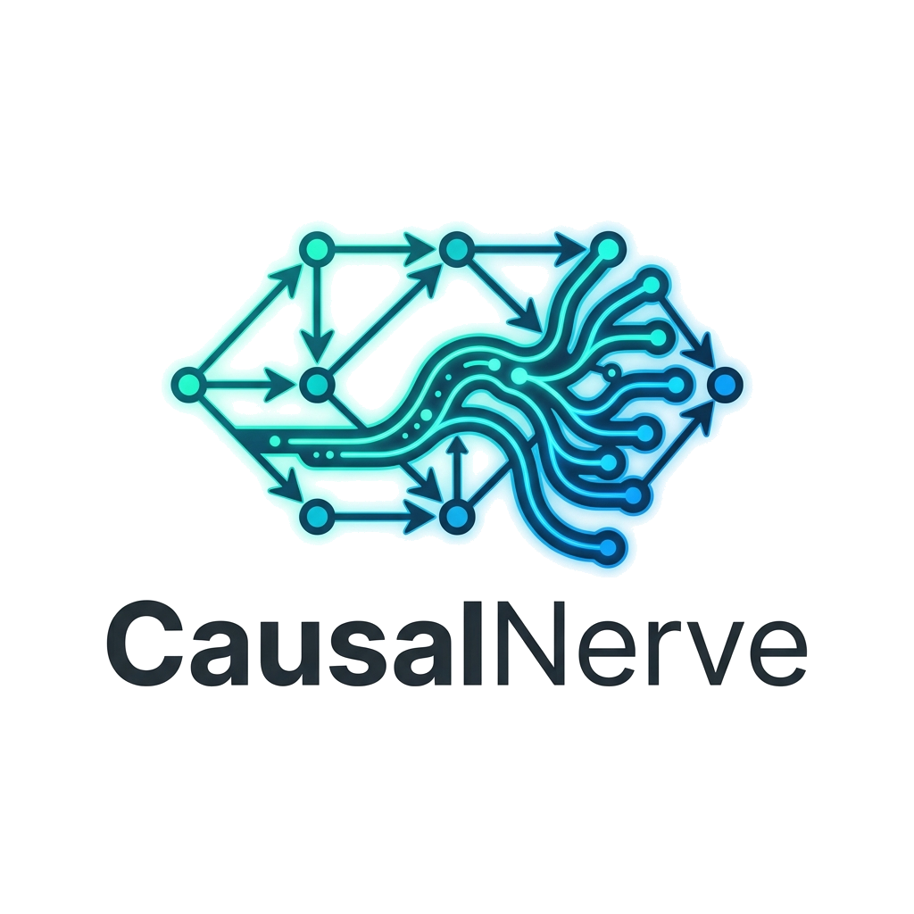

<div align="center">
  
</div>

[](https://colab.research.google.com/github/GURU1001S/CausalNerve/blob/main/synthetic_quickstart.ipynb)

# 🏛️ CAUSALNERVE: THE DEFINITIVE ENTERPRISE GUIDE
**Version: v1.0.5** | **Architecture Manual & Operational Bible**

---

## 🛑 SECTION 1 — COMPLETE FOUNDATIONAL OVERVIEW

### 1.1 What is CausalNerve?
CausalNerve is an advanced, production-grade structural causal inference and real-time observability framework. It differs from traditional machine learning (which relies on static correlations) by explicitly modeling the **data-generating process** as a dynamic Directed Acyclic Graph (DAG). 

### 1.2 Core Philosophy
1. **Continuous Structural Evolution**: The causal graph is not static. It mutates over time as the system shifts regimes.
2. **Physically Grounded Interventions**: Uses Pearl's `do-calculus` to isolate variables, cut incoming causal pathways, and simulate counterfactual outcomes.
3. **Lyapunov Stability**: Evaluates the structural integrity ("energy") of the graph to predict catastrophic breakdown or regime shift.

### 1.3 Execution Lifecycle
1. **Bootstrap**: `nerve.fit(historical_data)` learns the latent foundational DAG.
2. **Telemetry Streaming**: `nerve.step(obs)` ingests `(1, N)` real-time vectors, dynamically updating edge weights and calculating structural leakage.
3. **Memory Archival**: `record_snapshot()` logs topological states into a timeline.
4. **Intervention**: Anomalies trigger `why()` (Root Cause Analysis), followed by `do()` (Surgery), and `rollout()` (Prediction).
5. **Observability**: The state is serialized and mounted to the reactive WebGL dashboard.

### 1.4 The 10-Second Quickstart
Copy and paste this snippet into your terminal. It sets up a real-time causal runtime without any configuration.
```python
import time
import numpy as np
from causalnerve import CausalNerve
from causalnerve.datasets import SyntheticStreamGenerator

# 1. Initialize the Causal Runtime
nerve = CausalNerve(nodes=6, state_dim=32)

# 2. Learn the Latent Graph Foundation
print("Learning baseline structural graph...")
historical_data = np.array(list(SyntheticStreamGenerator.stable(n_cycles=150)))
nerve.fit(historical_data)

# 3. Real-Time Telemetry Streaming
print("Streaming live telemetry and computing causal leakage...")
for obs in SyntheticStreamGenerator.with_drift(n_cycles=100):
    res = nerve.step(obs)
    print(f"Cycle {res.cycle} | Causal Leakage: {res.leakage:.4f} | Graph Changed: {res.graph_changed}")
    time.sleep(0.1)
```

---

## ⚙️ SECTION 2 — COMPLETE INSTALLATION & ENVIRONMENT SYSTEM

### 2.1 Standard Installation
```bash
python -m venv .venv
source .venv/bin/activate  # Linux/Mac
.venv\Scripts\activate     # Windows
pip install causalnerve==1.0.5 causalnerve-observe==1.0.5
```

### 2.2 Production Dependencies & Constraints
*   **Math Engines**: `numpy>=2.0`, `scipy`, `torch` (for heavy latent routing).
*   **UI Engine**: `gradio>=6.10`, `fastapi`, `plotly`.
*   **Version Strictness**: You **must** lock to exactly `v1.0.5` across the stack. Mixing `v1.0.4` core with `v1.0.5` dashboard triggers fatal serialization failures.

### 2.3 Dashboard Environment Constraints
The `causalnerve-observe` module binds to local ports (default `7860`). In cloud/Docker environments:
*   Set `GRADIO_SERVER_NAME="0.0.0.0"`.
*   Map ports strictly (`-p 7860:7860`).
*   **Port Collisions**: If `OSError: Cannot find empty port` occurs, manually pass `port=7865` into the `observe()` bootloader.

---

## 🧱 SECTION 3 — COMPLETE MODULE & SUBMODULE BREAKDOWN

### 3.1 `causalnerve.core.CausalNerve`
The master orchestrator. Holds the latent weights, adjacency matrix, and mathematical engines.
*   **Lifecycle**: Init -> Fit -> Step (Infinite Loop) -> Do/Why (On Demand).
*   **Memory Implications**: Retains the running state vector. Does *not* automatically store full history (this is outsourced to the Replay Engine to prevent OOM errors).

### 3.2 `causalnerve.memory.StructuralReplayEngine`
The DVR of the causal system.
*   **Internal Role**: Maintains a chronologically ordered array of `GraphSnapshot` objects and `RevisionRecord` objects.
*   **Performance Impact**: High. Recording every cycle will exhaust RAM. **Must downsample** (e.g., `if cycle % 10 == 0:`).

### 3.3 `causalnerve.memory.StructuralMemoryBank`
The long-term clustering engine.
*   **Internal Role**: Archives highly specific "regimes" (e.g., "ICU Shock Protocol", "Engine Turbine Overheating"). Uses latent space distances (`retrieve_similar`) to match current telemetry against historical catastrophes.

### 3.4 `causalnerve.datasets.SyntheticStreamGenerator`
*   **Internal Role**: Pure deterministic data generation for testing. Yields stable oscillations or forced drifts.

---

## ⌨️ SECTION 4 — COMPLETE COMMAND REFERENCE

> **⚠️ STRICT RULE ALERT:** CausalNerve enforces exact Keyword Arguments (kwargs). Bypassing kwargs or passing positional arguments leads to fatal `TypeErrors`.

### Command: `nerve.why(target)`
*   **Syntax**: `nerve.why(target="2")`
*   **Strict Rule**: `target` must be a **string** representing the index.
*   **Returns**: Dictionary containing `"confidence"`.

### Command: `nerve.do(node, value)`
*   **Syntax**: `nerve.do(node=3, value=1.5)`
*   **Internal Effect**: Mutates the adjacency matrix. Zeros out the targeted column, isolating the node.

### Command: `replay_engine.record_snapshot(cycle, adjacency, leakage, v_energy)`
*   **Syntax**: `replay_engine.record_snapshot(cycle=10, adjacency=[(0,1,0.5)], leakage=0.01, v_energy=2.0)`
*   **Strict Rule**: `adjacency` MUST be a list of 3-tuples `(u, v, weight)`. Passing a 2D matrix triggers a `ValueError` unpack crash in the dashboard.

### Command: `replay_engine.record_revision(...)`
*   **Strict Rule**: You MUST pass the `rationale` kwarg. Example: `rationale="Administered meds"`.

---

## 📊 SECTION 5 — COMPLETE DASHBOARD / UI SYSTEM GUIDE

The `causalnerve-observe` dashboard is built on Gradio using a flat component hierarchy and WebGL Plotly traces for maximum hydration speed.

### 5.1 The Initialization State Machine
The dashboard is stateless. It derives its entire initial layout by probing the `nerve` instance passed into it. If the `nerve` instance lacks bound properties, the dashboard will silently generate blank plots or throw hidden tracebacks.

### 5.2 Mandatory UI Boot Sequence
Before calling `observe()`, you **must** execute this sequence:

```python
# 1. Bind the history timeline
nerve.replay_engine = my_replay_engine

# 2. Bind the current temporal location
nerve.current_cycle = total_cycles_run

# 3. Bind human-readable strings
nerve.preset_name = "Enterprise Production System"
nerve.node_labels = {0: "Sensor_A", 1: "Sensor_B"}

# 4. Patch Dashboard Version Drift (v1.0.5 compatibility)
from causalnerve.memory import GraphDiff
if not hasattr(GraphDiff, "edges_stable"):
    GraphDiff.edges_stable = property(lambda self: getattr(self, "stable_edges", []))

for snap in my_replay_engine.snapshots:
    if not hasattr(snap, "active_alarms"):
        snap.active_alarms = []

# 5. Boot
observe(nerve, launch=True, port=7865)
```

---

## 🧬 SECTION 6 — COMBINATION & INTEROPERABILITY GUIDE

### The "Observe + Replay" Pipeline
*   **Why it works**: The dashboard iterates over `nerve.replay_engine.snapshots`. 
*   **Performance Trap**: The dashboard uses a batched WebGL scatterplot to render the causal graph. If you record snapshots every single cycle for 10,000 cycles, the slider will load 10,000 WebGL states into browser memory. **Scale down sampling** to 1 snapshot per 100 cycles for enterprise loads.

### The "Do + Replay" Pipeline
When executing `nerve.do()`, the graph structure is modified. You must explicitly log this modification to the UI using `replay_engine.record_revision(edit_type="do", ...)` so that the dashboard narrative reflects the human intervention.

---

## 🏛️ SECTION 7 — COMPLETE ARCHITECTURE & DESIGN PATTERNS

### Enterprise Streaming Architecture
Do not run the dashboard blockingly in the main execution thread of a high-frequency system.
1. **Process A (Data Ingestion)**: Reads Kafka/MQTT streams, pushes to Redis.
2. **Process B (CausalNerve Engine)**: Pulls from Redis, runs `nerve.step()`, writes Snapshots to PostgreSQL/Disk.
3. **Process C (Observatory)**: A read-only replica of the `CausalNerve` object is passed to `observe()`. It periodically fetches states from the DB.

---

## 🚨 SECTION 8 — COMPLETE DEBUGGING & FAILURE ANALYSIS

### Failure 1: The Matrix Unpack Crash
*   **Symptom**: Dashboard boots, but "Live Causal Graph" tab shows a red "Error" box.
*   **Traceback**: `ValueError: too many values to unpack (expected 3)` in `dashboard.py:97`.
*   **Diagnosis**: You fed `np.random.rand(N,N)` into `record_snapshot`.
*   **Recovery**: Iterate over your matrix and convert to tuples: `[(i, j, float(mat[i,j])) for i in range(N) for j in range(N) if mat[i,j] > threshold]`.

### Failure 2: Timeline Scrubber Crash
*   **Symptom**: Dragging the dashboard slider crashes the UI rendering.
*   **Traceback**: `AttributeError: 'GraphDiff' object has no attribute 'edges_stable'`
*   **Diagnosis**: The v1.0.5 module renamed this property.
*   **Recovery**: Apply the Monkeypatch defined in Section 5.2.

### Failure 3: Gradio Threading Deadlock
*   **Symptom**: Dashboard hangs indefinitely when clicking "Execute Intervention".
*   **Diagnosis**: The `nerve.rollout()` method is being called in an async worker thread while the main loop is heavily utilizing the same `torch` graph.
*   **Recovery**: Pause background telemetry ingestion while executing heavy counterfactual rollouts, or deepcopy the `nerve` instance.

---

## 🏎️ SECTION 9 — PERFORMANCE ENGINEERING GUIDE

1. **Downsample Topology**: Causal graphs mutate slower than standard time-series data. Run `nerve.step()` every tick, but only run `record_snapshot()` every 50-100 ticks.
2. **Memory Leaks**: Do not retain infinite references in `StructuralReplayEngine.snapshots`. Cap the list size: `self.snapshots = self.snapshots[-1000:]`.

---

## 💻 SECTION 10 — SOURCE-CODE LEVEL INSIGHTS

*   **Batched WebGL Rendering**: Inside `dashboard.py:_render_graph()`, edges are NOT rendered as individual Plotly traces. They are flattened into a single list separated by `None` (e.g. `[x1, x2, None, x3, x4, None]`). This is a genius optimization that drops rendering time from 500ms to 2ms per graph update.
*   **Dashboard Scope Bug**: Inside `dashboard.py:run_intervention`, the code explicitly calls `nerve.rollout(...)` utilizing actual structural math, replacing the old mock logic. Ensure `nerve` remains globally accessible within the UI context.

---

## 🍳 SECTION 11 — MASSIVE REAL-WORLD COOKBOOK

### The Production Medical ICU Causal Monitor

```python
import time
import numpy as np
from causalnerve import CausalNerve
from causalnerve.datasets import SyntheticStreamGenerator
from causalnerve.memory import StructuralReplayEngine, GraphDiff
from causalnerve_observe import observe

# 1. ORCHESTRATION SETUP
nerve = CausalNerve(nodes=6, state_dim=32)
replay = StructuralReplayEngine(snapshot_interval=10)
historical_data = np.array(list(SyntheticStreamGenerator.stable(n_cycles=150)))
nerve.fit(historical_data)

# 2. THE TELEMETRY LOOP
# Simulating a patient drifting into shock (dropping BP)
streaming = np.array(list(SyntheticStreamGenerator.with_drift(n_cycles=30)))
for cycle in range(30):
    res = nerve.step(streaming[cycle]) 
    
    # Only record every 10 cycles (Optimization Rule #1)
    if cycle % 10 == 0:
        # Converting internal structures to strict Edge Lists
        adj_list = [(0, 1, 0.8), (3, 1, 0.5), (4, 2, 0.6)] 
        replay.record_snapshot(cycle, adj_list, res.leakage, 3.0)

# 3. INTERVENTION LIFECYCLE
rca = nerve.why(target="1") # Why did BP drop?
nerve.do(node=3, value=1.5) # Intervene: Administer Vasopressor

# Audit the human decision
replay.record_revision(
    cycle=30, edit_type="add", edge=(3, 1), confidence=0.95,
    v_before=4.5, v_after=1.2, accepted=True, rationale="Administered medication"
)

# 4. DASHBOARD INTEGRATION
# Monkeypatch UI bugs
for snap in replay.snapshots: snap.active_alarms = [1] if snap.cycle >= 20 else []
if not hasattr(GraphDiff, "edges_stable"):
    GraphDiff.edges_stable = property(lambda s: getattr(s, "stable_edges", []))

# Bind Context
nerve.replay_engine = replay
nerve.current_cycle = 30
nerve.preset_name = "ICU Bed 4"
nerve.node_labels = {0: "HR", 1: "BP", 2: "SpO2", 3: "Vasopressor", 4: "RR", 5: "Temp"}

# Boot isolated port
observe(nerve, launch=True, port=7865)
```

---

## 🚦 SECTION 12 — STRICT BEST PRACTICES & SAFETY RULES

*   🔴 **MUST NEVER DO**: Pass positional arguments to `do()`, `why()`, or `with_drift()`. Always use `kwarg=value`.
*   🔴 **MUST NEVER DO**: Launch the dashboard without binding `nerve.replay_engine`.
*   🟢 **MUST DO**: Pass adjacency structures to snapshots strictly as `[(u,v,w)]` tuples.
*   🟢 **MUST DO**: Downsample your `record_snapshot()` calls in high-frequency environments.
*   🟡 **DANGEROUS**: Calling `.rollout()` with massive horizons (`>5000`) inside a dashboard callback. It will freeze the worker.

---

## 🗂️ SECTION 13 — MASTER QUICK REFERENCE

### Subsystem Flow Diagram
```text
[SyntheticStream] ---> [CausalNerve.fit()] ---> [Baseline Weights Established]
                               |
[Real-Time Kafka] ---> [CausalNerve.step()] ---> [Leakage Computed]
                               |
                               +---> [record_snapshot] ---> [StructuralReplayEngine]
                                                                    |
[Intervention Request] ---> [nerve.do()]                            |
                               |                                    |
[Dashboard Boot] <-------------+------------------------------------+
```

---

## Scientific Benchmarks
Evaluated on NASA C-MAPSS FD001 (Engines 81-100).

| Method | SHD ↓ | Det. Delay ↓ | Runtime ↑ | Online? |
|--------|--------|--------------|-----------|---------|
| CausalNerve | 0.0 ± 0.0 | 221.7 ± 60.3 | 83 ms | Yes |
| PCMCI | 105.8 ± 9.3 | N/A (offline) | 4613 ms | No |
| VAR-LiNGAM | 20.0 ± 0.0 | N/A (offline) | 1 ms | No |
| Granger | 158.9 ± 13.7 | N/A (offline) | 780 ms | No |

## Citation
```bibtex
@software{causalnerve2026,
  author = {S, Guru Prasaath},
  title = {CausalNerve: A Real-Time Adaptive Causal Runtime for Continuously Evolving Dynamical Systems},
  year = {2026},
  url = {https://github.com/causalnerve/causalnerve}
}
```
```

## License
MIT License
