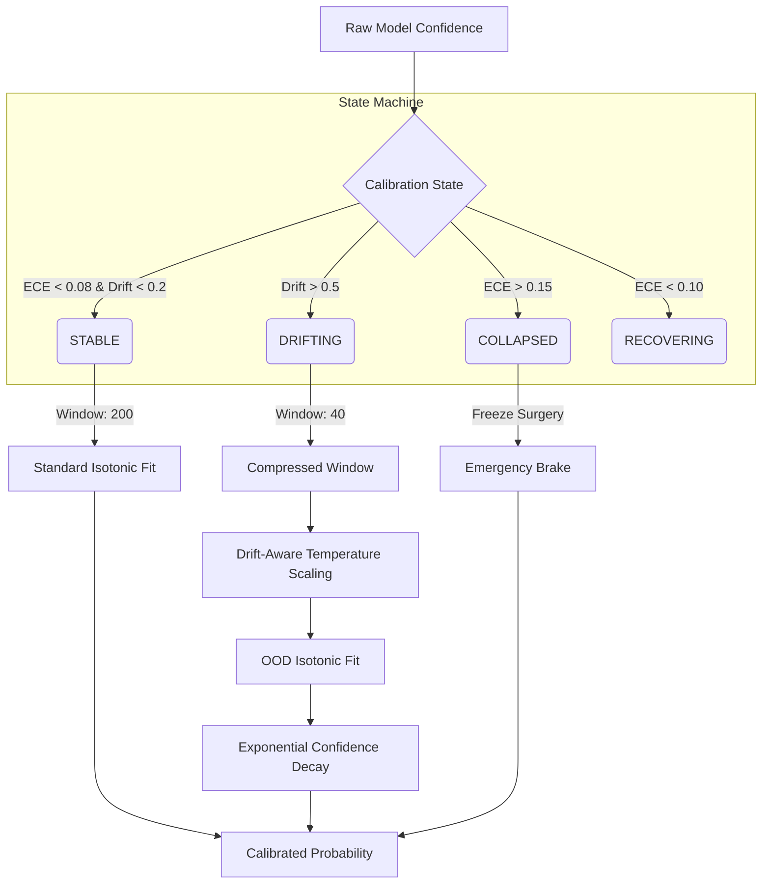

# Calibration Hardening V2 Architecture

```mermaid
graph TD
    A[Raw Model Confidence] --> B{Calibration State}
    
    subgraph State Machine
        B -->|ECE < 0.08 & Drift < 0.2| C(STABLE)
        B -->|Drift > 0.5| D(DRIFTING)
        B -->|ECE > 0.15| E(COLLAPSED)
        B -->|ECE < 0.10| F(RECOVERING)
    end
    
    C -->|Window: 200| G[Standard Isotonic Fit]
    D -->|Window: 40| H[Compressed Window]
    E -->|Freeze Surgery| I[Emergency Brake]
    
    H --> J[Drift-Aware Temperature Scaling]
    J --> K[OOD Isotonic Fit]
    K --> L[Exponential Confidence Decay]
    
    G --> M[Calibrated Probability]
    L --> M
    I --> M
```
