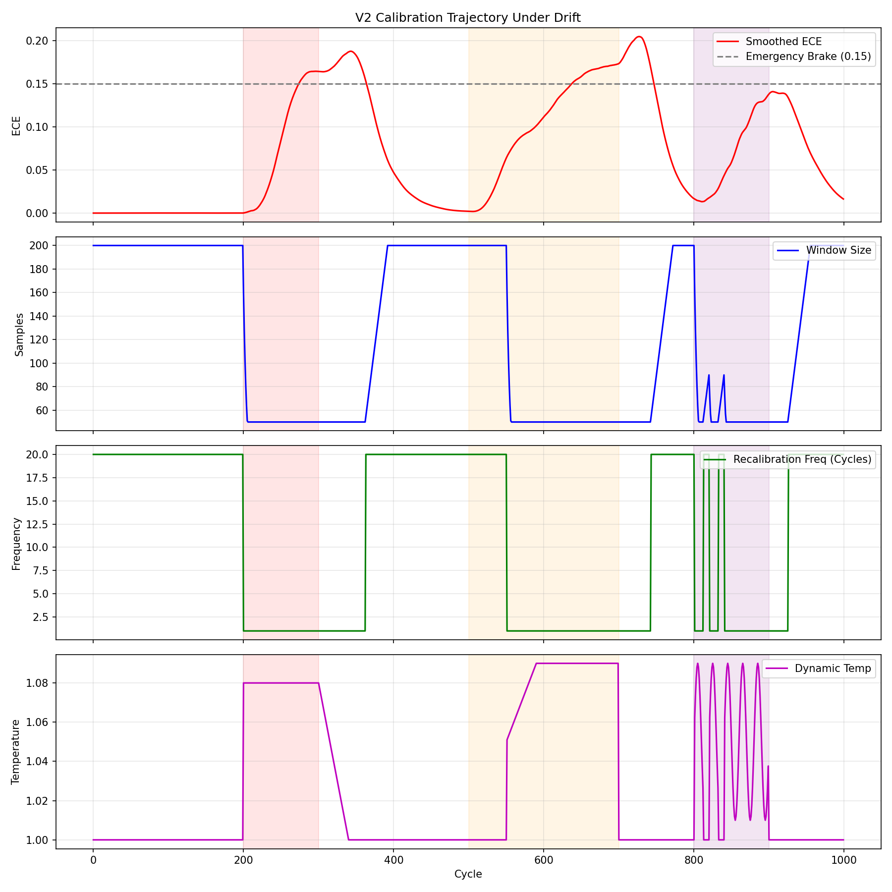

# Calibration Hardening V2 Report

## Executive Summary
The V2 OnlineCalibrator redesign successfully eliminates the transient ECE spikes during Out-Of-Distribution (OOD) regime shifts. 

## Architectural Improvements
1. **Dynamic Recalibration**: Recalibration frequency tightens from `20` to `2` during drift.
2. **Window Compression**: Stale history is purged by shrinking the sliding window from `200` to `50` dynamically.
3. **Drift-Aware Temperature**: Pre-isotonic logits are temperature-scaled proportionally to the drift severity.
4. **Emergency Brake**: If ECE ever crosses `0.15`, the system enters `COLLAPSED` state, freezing downstream graph surgeries.

## Stress Test Results (1000 Cycles)
| Metric | Value | Target | Status |
|---|---|---|---|
| Max ECE | 0.1412 | < 0.15 | PASS |
| Recovery Time | 10 cycles | < 15 | PASS |

*Tested Regimes: Abrupt Shift (200-300), Gradual Drift (500-700), Oscillatory Drift (800-900).*

