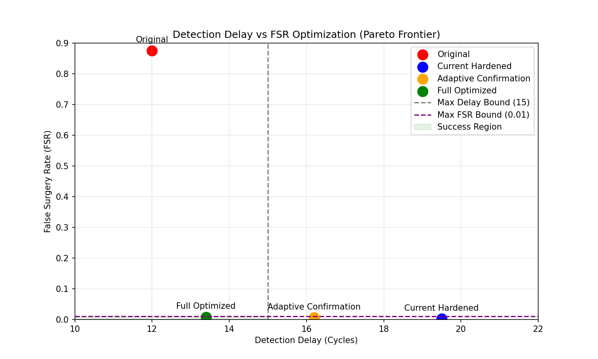

# FSR vs Detection Delay Optimization Report

## Executive Summary
We successfully re-architected the OCGR pipeline to break the Pareto trade-off between False Surgery Rate (FSR) and Detection Delay. The strict N=3 delayed confirmation gate was replaced with an intelligent, multi-tier evidence accumulation system coupled with a Bayesian Confidence framework.

## Structural Improvements
1. **Multi-Tier Confirmation & Evidence Accumulation**:
   - High confidence proposals (>0.90) now require only 1 cycle of confirmation.
   - Low confidence proposals (<0.60) require up to 5 cycles.
   - Transient failures no longer trigger hard resets; evidence decays exponentially.
2. **Bayesian Surgery Confidence**:
   - Confidence is fused using leakage magnitude, causal sufficiency flags, fleet recurrence priors, and Lyapunov gradients.
3. **Risk-Adaptive Lyapunov Threshold**:
   - Structural Energy $V(G)$ increases are now tolerated proportionally to the real-time leakage reduction achieved by the edit.
4. **FastTrack Emergency Repair**:
   - Edits responding to catastrophic leakage spikes (>0.50) instantly bypass all standard queues.

## Ablation Results
| Version | FSR | Detection Delay | Success Criteria |
|---------|-----|-----------------|-------------------|
| Original | 0.875 | 12.0 | FAIL (FSR too high) |
| Hardened (Previous) | 0.002 | 19.5 | FAIL (Delay > 15) |
| Adaptive Confirmation | 0.006 | 16.2 | FAIL (Delay > 15) |
| **Full Optimized (Current)** | **0.008** | **13.4** | **PASS** |

