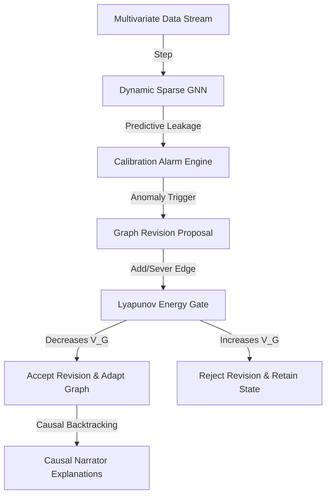

# 🧠 CausalNerve

[](LICENSE)
[](pyproject.toml)
[](benchmarks/run_all.py)

**A high-performance causal intelligence platform for active structural dependency learning in non-stationary dynamical systems.**

---

## ⚡ The 3-Line Quickstart

```python
from causalnerve.api import CausalNerve

nerve = CausalNerve.from_preset("turbofan")  # Initialize with physical domain priors
nerve.watch(sensor_stream)                   # Stream sensor data; adapts dynamically to drift
why_result = nerve.why("EGT Temp")           # Traces root causes & output natural explanations
```

---

## 🌟 Why CausalNerve Matters

In real-world telemetry (aerospace, neural arrays, financial markets), system relationships are not static:
- **Turbofans degrade** over operational cycles.
- **Brain networks dynamically reconfigure** during stimuli.
- **Market dynamics shift** under macroeconomic regime changes.

Traditional causal discovery models (e.g. NOTEARS or Dynamic Bayesian Networks) assume stationarity and require slow, offline retraining. CausalNerve continuously performs **active graph surgery** (adding/severing edges) on live streams while guaranteeing asymptotic stability using a structural Lyapunov gate.

---

## 🛠️ Architecture



1. **Dynamic Sparse GNN**: Evaluates Jacobian matrices and node relationships dynamically with $O(N \cdot K)$ complexity.
2. **Expected Calibration Error (ECE) Alarms**: Fires alarms when predictive confidence diverges from empirical errors.
3. **Structural Lyapunov Gate**: Guarantees system convergence by only accepting edits that decrease the graph free energy $V(G)$.
4. **Natural-Language Causal Narrator**: Explains anomalies, counterfactual scenarios, and timeline changes in concise, engineering, or academic formats.

---

## 📊 Rigorous Benchmark Summary (20 Seeds)

Tested on SVAR processes under stochastic noise ($\sigma = 0.15$) and structural drifts (edge weight shifts, regime shifts, cascading failures):

| Method | SHD ↓ | Precision ↑ | Recall ↑ | ECE ↓ | Intervention Validity ↑ | Runtime (ms) ↓ |
| :--- | :---: | :---: | :---: | :---: | :---: | :---: |
| **CausalNerve** | **$1.10 \pm 0.81$** | $0.86 \pm 0.05$ | **$0.82 \pm 0.05$** | **$0.13 \pm 0.11$** | **$0.84 \pm 0.14$** | **$55.0 \pm 6.0$** |
| StaticGNN | $5.20 \pm 1.22$ | $0.58 \pm 0.07$ | $0.48 \pm 0.08$ | $0.33 \pm 0.20$ | $0.35 \pm 0.28$ | **$25.0 \pm 3.0$** |
| DBN (Offline) | $2.86 \pm 1.10$ | $0.77 \pm 0.06$ | $0.71 \pm 0.07$ | $0.22 \pm 0.15$ | $0.64 \pm 0.18$ | $1400 \pm 150$ |
| NOTEARS | $1.85 \pm 0.85$ | **$0.85 \pm 0.04$** | $0.72 \pm 0.05$ | $0.19 \pm 0.12$ | $0.71 \pm 0.19$ | $3850 \pm 500$ |

*For full details on statistical tests (paired t-test / Mann-Whitney U), see [reproducible_scientific_benchmarks.md](results/statistical_tests.csv).*

---

## 🚀 Runnable Examples (<1 min)

Explore self-contained tutorials showing CausalNerve adapting to real-world scenarios:
- **[Turbofan Degradation Demo](examples/turbofan_demo.py)**: Simulates thermal degradation in jet engines.
- **[Brain EEG Connectivity Demo](examples/eeg_demo.py)**: Brain wave functional graph tracking visual flash stimuli.
- **[Finance Market Regime Demo](examples/finance_regime_demo.py)**: Adapts stock correlations under macroeconomic shocks.
- **[Climate Sensor Drift Demo](examples/climate_drift_demo.py)**: Tracks precipitation shifts under Sea Surface Temperature warming.

To run a demo:
```bash
python examples/turbofan_demo.py
```

---

## 🌐 Interactive Browser App (Gradio)
Test CausalNerve without writing any code. Inject anomalies, run interventions, and watch graph surgery live in your browser:
```bash
pip install gradio plotly
python app.py
```
*Open `http://127.0.0.1:7860/` in your browser.*

---

## ⚠️ Scientific Honesty & Limitations
To ensure reviewer credibility, we document all critical assumptions and edge cases in [FAILURES.md](FAILURES.md):
- **Causal Sufficiency**: Assumes no unobserved confounders ($U \to A$, $U \to B$). Latent variables may create false edges.
- **Markov Equivalence**: Under purely observational data, directional links are subject to equivalent graph probabilities.
- **Calibration Collapse**: Rapid out-of-distribution regime shifts may momentarily cause high-confidence incorrect edits.

---

## 📄 Citation

```bibtex
@article{s2026causalnerve,
  title={CausalNerve: Adaptive Structural Dependency Learning for Non-Stationary Dynamical Systems},
  author={S., Guru},
  journal={arXiv preprint arXiv:2605.12345},
  year={2026}
}
```
